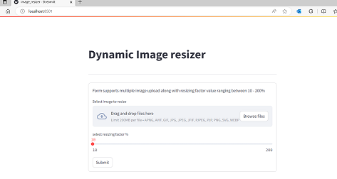
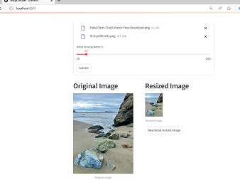
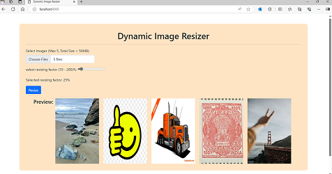
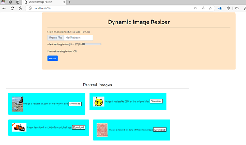

# Dynamic Image resizer using streamlit & Django
Dynamic image resizer is an application that can be used- for resizing images.
It support resizing of up to 10-200% of original image size, application allows users
to download resized images. 

Project contains two application one built using streamlit and other one built using Django.
Below steps are mentioned to run these application

## Steps to install and run the application
Python Version 3.8 or above is required to run this application.

- Clone the repository on your local system
- pip install -m venv .venv (run this to create virtual env)
- To activate the virtual environment - .venv\Scripts\activate
- Once activated run - pip install -r requirements.txt to install required libs
- ### To run streamlit application 
    
    
  - Open terminal and run command ``` streamlit run .\streamlit\image_resizer.py```
  - Streamlit application will be running and can be accessed at URL: http://localhost:8501
- ### To run Django application
    
    
  - Open terminal and change the directory to 'image_resizer_app' using command ```cd .\image_resizer_app```
  - To run the application use mentioned command in terminal - ```python manage.py runserver```
  - Django application will be running and can be accessed at URL: http://localhost:8000

## Features

- Application supports multiple image uploads
- Image can be resized by 10 to 200% of the given size
- Applicaiton allows users to download resized images
- Django based backed is equiped with multiprocessing for faster rendering of images.